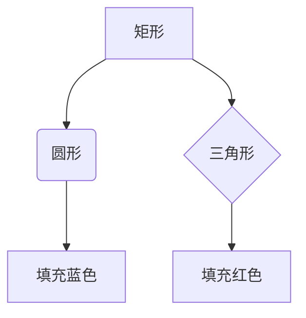
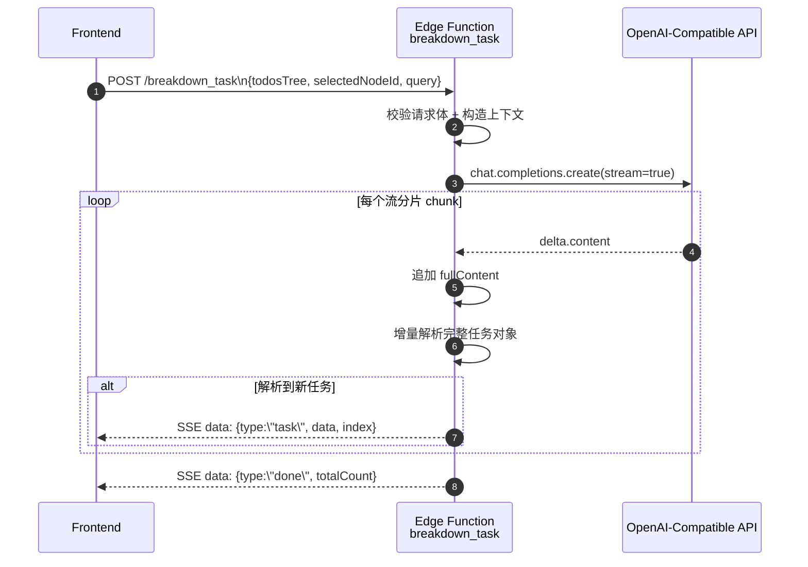

# 标题

### 题目

题目描述

### 回答

> 这是一个引用块，可以用来引用文本或者代码。

### 代码

```python
def fibonacci(n):
    if n <= 0:
        return 0
    elif n == 1:
        return 1
    else:
        return fibonacci(n-1) + fibonacci(n-2)
print(fibonacci(10))
```

### 公式

- 行内公式：$E=mc^2$
- 块级公式：

$$f(x) = \int_{-\infty}^{\infty} e^{-t^2} dt$$

- 矩阵：
$$
\begin{bmatrix}
a & b \\ c & d
\end{bmatrix}
$$

- 箭头：

$$ x \xrightarrow{m} y $$


# 绘图

## Mermaid






## TikZ

```tikz
\begin{document}
\begin{tikzpicture}
  % Rectangle
  \draw[thick] (0,0) rectangle (2,1.5);
  % Circle
  \draw[fill=blue!20] (4,0.75) circle (0.75);
  % Triangle
  \draw[fill=red!20] (6,0) -- (7.5,0) -- (6.75,1.5) -- cycle;
\end{tikzpicture}
\end{document}
```

## HTML+CSS 增强排版

