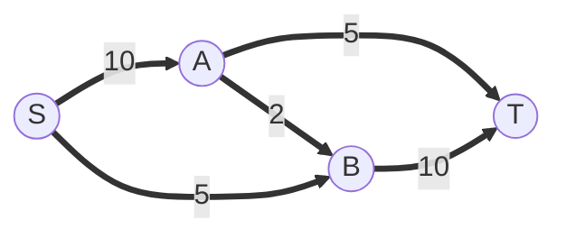
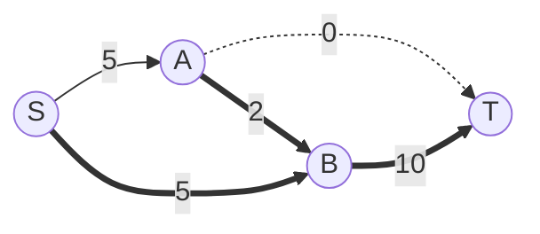
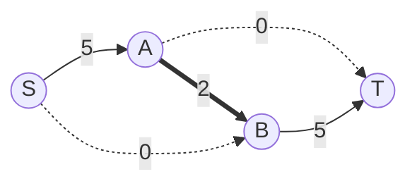
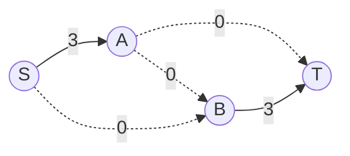
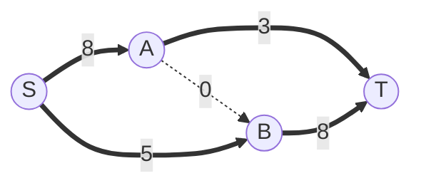
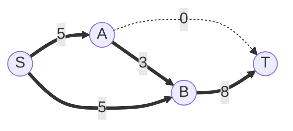

---
要求题目:
---

# 第9章 图算法+

## 最大流问题

初始管道容量:

### Ford-Fulkerson增广法

先找一条可行路径, 比如 `S -> A -> T` , 最大通过流量为 5, 管道剩余容量为:

再填满路径 `S -> B -> T` , 最大通过流量为 5, 管道剩余容量为:

最后填满路径 `S -> A -> B -> T` , 最大通过流量为 2, 管道剩余容量为:

引入反向边

假如选择方法不对, 比如先填满路径 `S -> A -> B -> T` , 最大通过流量为 2, 管道剩余容量为:

继续填满路径 `S -> A -> T` , 最大通过流量为 3, 管道剩余容量为:

最大流最小割定理: 此时有三条边的容量为0, 如果在开始时把这三条边切开, 就是图的一个最小割, 最大流量 = 最小割 = 12。

### Edmonds-Karp算法 (BFS广度优先增广法)

## 二分图匹配问题
