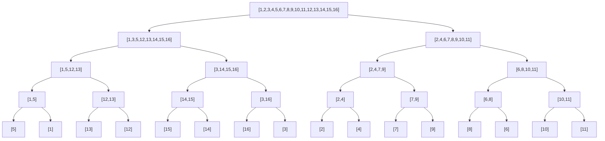

---
要求题目:2,3,7,9;
---

# 第6章 动态规划


### 装配线调度问题

- [x] **6.2**

说明应如何修改程序 `PrintStations`，使它能以装配点的递增顺序输出各装配点。提示：使用递归。

```python
# 书上写的 l* 无法用在 Python 语法中, 这里改用 L 代替
# 原程序:
def PrintStations(l, n):
    i = L
    print('line', i, 'station', n)
    # 从后往前输出装配点
    for j in range(n, 2, -1):
        i = l[i][j]
        print('line', i, 'station', j-1)
```

**答:**

```python
# 修改后的程序:
# 递归不变量: PrintStations(l, i, L) 会顺序输出前 i 站的装配点
def PrintStations(l, n, L):
    # 原表从2开始索引
    # n = 2 时, 不变量成立
    if n == 2:
        print('line', L, 'station', n)
        return
    # i = n-1 时, 已经顺序输出前 n-1 站的装配点
    PrintStations(l, n-1, l[L][n])
    # 输出第 n 站的装配点
    print('line', L, 'station', n)
```


- [x] **6.3**

保存 f 和 l 值的表，总大小为 4n-2，说明如何把表的大小缩减到 2n+2，使之仍然能够计算出 $f^*$，并且仍然能够构造出最快装配路线。

**答:**

> 数组 a1, a2 中每个装配点的值只用一次就不再使用了，因此用过后可以覆盖。直接用 a1 储存 f1, a2 储存 f2, 节省 $2n$ 个空间。
>
> 编程实测 $2n - 2$ 的空间足以完成算法, 不需要 $2n+2$;

### 矩阵链乘法问题


- [x] **6.7**

画出 `MergeSort` 算法排序 16 个元素的递归树。解释在提高一个好的分治算法，例如 `MergeSort` 的效率时，利用备忘录方法为什么没有效果。

**答:**

给定16个无序元素, 例如 a = [5, 1, 13, 12, 15, 14, 16, 3, 2, 4, 7, 9, 8, 6, 10, 11], `MergeSort` 的递归树如下所示:



> `MergeSort` 的子问题按区间划分后总是不同的问题，不存在重复子问题, 因此备忘录方法没有效果。


### 最长公共子序列

- [x] **6.9**

已知原始序列 $X_m = <x_1, x_2, ..., x_m>$ 和 $Y_n = <y_1, y_2, ..., y_n>$，假设已计算出表 c，说明不用表 b，也可以在 $O(m+n)$ 时间内构造一个 LCS。

**答:**

> 表 c 的长宽分别为 m+1 和 n+1, 从 c[m][n] 开始, 如果 $x_m = y_n$, 则找到 LCS 的最后一个元素, 跳到 $c[m-1][n-1]$; 否则比较 $c[m-1][n] 和 c[m][n-1]$, 选择较大的一个继续向前查找. 直到 $c[i][j] = 0$ 时, 说明已经找到 LCS 的第一个元素, 结束查找. 因为每次查找都向前移动了一个元素, 最多移动 m+n 次, 因此时间复杂度为 O(m+n).


**6.21**

给定一个由 n 行数字组成的数字三角形，如图 6.21 所示。试设计一个算法，输出从三角形的顶至底的一条路径，使该路径经过的数字总和最大。

图 6.21 数字三角形示例:
```
         9        
        / \       
       3   8      
      / \ / \     
     8   1   0    
    / \ / \ / \   
   2   7   9   4  
  / \ / \ / \ / \ 
 3   5   2   6   2 
```

**答:**

> - S[0] = [9]
> - S[1] = [3, 8]
> - S[2] = [8, 1, 0]
> - S[3] = [2, 7, 9, 4]
> - S[4] = [3, 5, 2, 6, 2]
>
> 定义 f[i][j] 为从 S[i][j] 到底部路径的最大和, 则有:
>
> f[i][j] = S[i][j] + max(f[i+1][j], f[i+1][j+1]);
>
> 从底部开始计算, 最后 f[0][0] 就是从顶部到底部路径的最大和. 
>
> 计算完成后, 从 f[0][0] 开始, 每次选择较大的那个子问题, 就可以得到路径上的元素.

**6.22**

将 $3 \times n$ 的布条切割成 $2 \times 1$ 的方块，有多少种切割方案？

**答:**

> ...

可视化: https://luciopaiva.com/dominoes/

**6.24**

n 个人参加拔河比赛，每个人有自己的重量，现在需要把他们分成两组进行比赛，每个人属于其中的一个组，两组的人员个数相差不能超过 1。为使比赛公平，求使得两组重量差最小的分配。

**答:**

> ...
