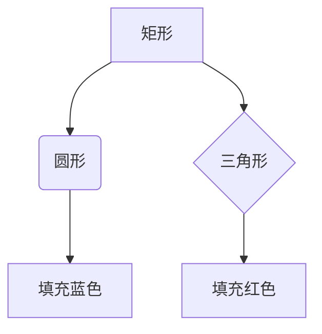

# Homework

文字,公式,代码,插图混合写作方案

### 方案一：Markdown

LaTeX 公式 + Mermaid + TikZ 作图

#### 依赖

- VSCode
- VSCode 插件：Markdown Preview Enhanced（支持 LaTeX 公式 + Mermaid + TikZ 作图）


#### LaTeX 公式示例

- 行内公式：$E=mc^2$
- 块级公式：

$$f(x) = \int_{-\infty}^{\infty} e^{-t^2} dt$$

- 数组公式：
$$
\begin{bmatrix}
a & b \\ c & d
\end{bmatrix}
$$

- KaTeX 支持的扩展

  - mathtools (增强数学工具)
  $$\text{X} \xrightarrow{\text{M}} \text{Y}$$


#### Mermaid 示例



#### TikZ 示例

```tikz
\begin{document}
\begin{tikzpicture}
  % Rectangle
  \draw[thick] (0,0) rectangle (2,1.5);
  % Circle
  \draw[fill=blue!20] (4,0.75) circle (0.75);
  % Triangle
  \draw[fill=red!20] (6,0) -- (7.5,0) -- (6.75,1.5) -- cycle;
\end{tikzpicture}
\end{document}
```

---

### 方案二：Typst

#### 依赖

- VSCode
- VSCode 插件: Tinymist Typst
- Typst 引擎: `winget install Typst`

#### 第三方库

| 库名 | 说明 | 适用场景 | 推荐度 |
|------|------|----------|--------|
| **CeTZ** | Typst 世界的"TikZ"，是一切绘图的基础 | 几乎所有复杂图形 | ★★★☆ |
| **fletcher** | 绘制交换图和带箭头图表的专业工具 | 数学中的交换图、态射图 | ★★☆☆ |
| **finite** | 专门绘制有限状态机（Mealy/Moore） | 状态机图、自动机 | ★★☆☆ |
| **cirCeTZ** | 专门绘制电路图的包 | 电子学、物理作业中的电路 | ★★☆☆ |
| **diagraph** | Graphviz (DOT语言) 的插件 | 用文本描述复杂的关系图、流程图 | ★☆☆☆ |
| **plotsy** | 基于 CeTZ 的 2D/3D 科学绘图库，类似 LaTeX 的 pgfplots | 函数曲线、数据图表、3D 曲面 | ★★★☆ |
| **rechner** | 绘制各类流程图和算法图 | 程序流程图、业务逻辑图 | ★★☆☆ |
| **wavy** | WaveDrom 插件，用于绘制时序图 | 数字电路中的时序波形图 | ★☆☆☆ |