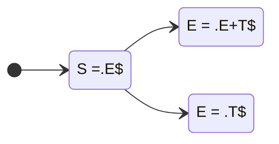

文法:

- (0) S = E$
- ① E = E+T
- ② E = T
- ③ T = T*F
- ④ T = F
- ⑤ F = (E)
- ⑥ F = n

开头字符集(FIRST集):

- FIRST(E) = { (, n } + { E, T, F }
- FIRST(T) = { (, n } + { T, F }
- FIRST(F) = { (, n }

后续字符集(FOLLOW集):

- FOLLOW(E) = { $, +, ) }
- FOLLOW(T) = { $, +, ), * }
- FOLLOW(F) = { $, +, ), * }

