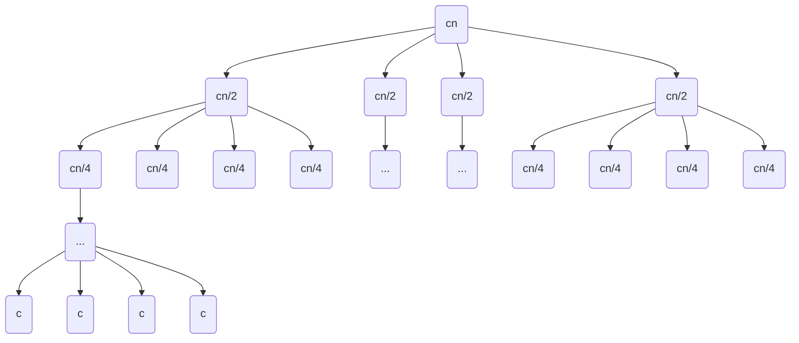

# 复杂度分析方法

## 概率分析

适用于确定性算法的平均复杂度分析, 假设输入数据符合某种概率分布（如均匀分布），从而计算期望运行时间。

##### 分析 FindMax(A) 算法的平均时间复杂度。

```python
def FindMax(A):
    # A 是一个无序数组, 包含 n 个元素
    max = A[0]                  # O(1)
    for i in range(1, len(A)):  # O(1)*(n-1)
        if A[i] > max:          # O(1)*(n-1)
            max = A[i]          # O(1)*k, k∈[0, n-1]
    return max                  # O(1)
```

答:

> 时间复杂度: $T(n) = O(1) * (2n+k)$;
> 
> 循环内部赋值操作的次数 $k$ 取决于数据的排列情况;
> - 最坏情况: $k = n-1$, 数据升序排列的情况;
> - 最好情况: $k = 0$, 最大值排在开头的情况;
> - 平均情况: 
> 按 $k=i$ 分类统计很麻烦; 可以改变求和方式, 统计各个元素 $A[i]$ 发生赋值的概率;
>
> 以 A = [1, 2, 3] 为例:
>
> |   |A[0]|A[1]|A[2]|k|
> |:-:|:-:|:-:|:-:|:-:|
> |   | 1 |[2]|[3]| 2 |
> |   | 1 |[3]| 2 | 1 |
> |   | 2 | 1 |[3]| 1 |
> |   | 2 |[3]| 1 | 1 |
> |   | 3 | 1 | 2 | 0 |
> |   | 3 | 2 | 1 | 0 |
> |合计|0 | 3 | 2 | 5 |
>
> - A[1] 发生赋值的条件是 $A[1] >  A[0]$, 概率为 $\frac{1}{2}$;
> - A[2] 发生赋值的条件是 $A[2] > A[0], A[1]$,  概率为$\frac{1}{3}$;
> - ...
> - A[n-1] 发生赋值的条件是 $A[n-1] > A[0...n-2]$, 概率为 $\frac{1}{n}$;
> 
> 平均情况下赋值次数为: $\frac{1}{2} + \frac{1}{3} + ... + \frac{1}{n} < \ln n$;
> 
> 得: $T(n) = O(2n+ \lg n)$;

## 均摊分析 (Amortized Analysis)

用于分析长期系统, 涉及备份, 扩容, 清理缓存等耗时操作的平均时间复杂度。

#### 动态栈分析

动态栈通过扩容机制支持储存任意数量元素:
初始时栈容量为 10, 每当栈满时又遇到 push() 操作就触发扩容, 将栈的大小翻倍, 扩容的时间成本为 O(L), 其中 L 是当前栈的大小。证明动态栈的 push() 和 pop() 操作的均摊时间复杂度为 O(1)。

**答:**

##### 合计方法 (aggregate method)

合计 k 次操作的总成本, 再除以 k 得到平均费用。

- 扩容操作只会发生在 L = 10, 20, 40, 80, ... 时;
- 设 k = 2^n * 10 次操作, 则最多发生 n 次扩容操作;
- 总成本 T(k) <= k + 10 * (1 + 2 + 4 + ... + 2^(n-1)) = 2k - 10;

单次操作平均成本 T(1) = T(k) / k < 2 = O(1)。 

##### 记账方法 (accounting method)

- 设每个 push() 操作的分摊成本为 2;
- pop() 操作的分摊成本为 1;
- 则任意时刻栈中元素个数为 m 时, 账户余额为 2m - m = m >= 0;

##### 势能方法 (potential method)


**3.10** 计数器分析

计数器由 $k$ 位二进制数构成, 初始值为 0, 每次操作将计数器加 1。每个位翻转的时间成本为 1, 证明加 1 操作的均摊成本为 O(1)。

对于一个计数器加运算序列，如果计数器不从 $0$ 开始，用势能方法分析该序列的时间复杂度。

**答:**

> 设势能函数 $Φ(D_i)$ = 计数器中 `1` 的位数;
> 
> `计数器+1` 操作的分摊费用: $\hat{c}_i = c_i + Φ(D_i) - Φ(D_{i-1})$:
> - 设 $D_i$ 操作前计数器从最低位起连续 $k$ 位为 1;
> - 则 $D_i$ 操作后这 $k$ 位变为 0, 第 $k+1$ 位由 0 变为 1;
> - $c_i = k+1$;
> - $Φ(D_i) - Φ(D_{i-1}) = (1-k)$;
> - 因此 $\hat{c}_i = (k+1) + (1-k) = 2$;
>
> 分摊费用求和:
> - $\sum_{i=1}^n \hat{c}_i = \sum_{i=1}^n c_i + Φ(D_n) - Φ(D_0) = 2n$;
>
> 实际费用求和:
> - $T(n) = \sum_{i=1}^n c_i = 2n + Φ(D_0) - Φ(D_n) \leq 2n + Φ(D_0)$。
> 
> $Φ(D_0)$ 不会超过计数器的位数, 故:
> - $T(n) = O(n)$。


## 递归分析

递归方程 $T(n)$ 描述了一个递归算法的时间复杂度, 其中 $n$ 是输入规模, $T(n)$ 是算法在输入规模为 $n$ 时的运行时间。

### 代入法/数学归纳法 (Substitution Method)

代入法是先猜测递归方程的解, 然后通过数学归纳法证明猜测的正确性。

- [ ] **4.11**

利用变量替换方法求解递归方程 $T(n)=2T(\sqrt{n})+1$，要求得到的解应当是渐近紧界，不必担心值是否为整数。

- [ ] **4.14**

证明递归方程 $T(n)=T(n/3)+T(2n/3)+O(n)$ 的解为 $T(n)=O(n\lg n)$。

- [X] **4.9**

证明递归方程 $T(n)=2T(\lfloor n/2 \rfloor + 17)+n$ 的解为 $T(n)=O(n\lg n)$。


> 把 $T(n)=O(n\lg n)$ 代入递归方程右式, 得:
>
> - $T(n) = 2 \cdot O((\lfloor n/2 \rfloor+17) \lg(\lfloor n/2 \rfloor+17)) + n$
> - $T(n) \leq c(n+34)\lg(\frac{n+34}{2}) + n$
> - $T(n) \leq c(n+34)\lg(\frac{n+34}{2}) + n+34$
> - $T(n) \leq c(n+34)(\lg(\frac{n+34}{2}) + 1)$
> - $T(n) \leq c(n+34)(2\lg(\frac{n+34}{2}))$
> - $T(n) \leq 4c(\frac{n+34}{2})\lg(\frac{n+34}{2})$
>
> 当 $n \geq 34$:
>
> - $T(n) \leq 4c(\frac{n+34}{2})\lg(\frac{n+34}{2}) \leq 4c n \lg n$;
>
> 故: $T(n) = O(n\lg n)$

- [ ] **4.10**

证明递归方程 $T(n)=2T(\lceil n/2 \rceil)+n$ 的解为 $T(n)=O(n\lg n)$，并证明这个递归方程的解也是 $\Omega(n\lg n)$。

### 递归树方法 (recursion-tree method)

- [X] **4.12** #DONE

画出递归方程 $T(n)=4T(\lfloor n/2 \rfloor)+cn$ 的递归树，并给出其解的渐近紧界；然后用替换方法(代入法)证明给出的界，其中 $c$ 是一个常数。

**答:**



> 树的高度为 $\lfloor \log_2 n \rfloor$;
>
> - $T(n) = c(n + 4(n/2) + 16(n/4) + ... + 4^{\lfloor \log_2 n \rfloor}(n/2^{\lfloor \log_2 n \rfloor}))$
> - $T(n) = cn(1 + 2 + 4 + 8 + ... + 2^{\lfloor \log_2 n \rfloor}) \leq cn(2n-1)$
>
> 猜测: $T(n) = \Theta(n^2)$
>
> 证明: 把 $T(n) = \Theta(n^2)$，代入原方程：
>
> - $T(n) = 4 \cdot \Theta(\lfloor n/2 \rfloor^2) + cn$
> - $T(n)\leq c_1n^2 + cn$;
> - $T(n)\leq (c_1+1)n^2, (n \geq c)$;
>
> 又有:
>
> - $T(n) \geq c_2(n-1)^2 + cn$
> - $T(n) \geq c_2(n-1)^2, (n \geq c)$
> - $T(n) \geq c_2(\frac{n-1}{2})^2, (n \geq 2)$
> - $T(n) \geq \frac{c_2}{4} n^2, (n \geq max\{c,2\})$
>
> 故: $T(n) = \Theta(n^2)$

- [ ] **4.13**

利用递归树方法估计递归方程 $T(n)=T(n-a)+T(a)+cn$ 的渐近紧界，其中 $a,c$ 是常数，且 $0<a<1,\ c>0$。

### 公式法 (master method)

公式法适用于形如 $T(n)=aT(n/b)+f(n)$ 的递归方程, 其中 f(n) 是多项式函数, a>=1, b>1 是常数。

推导过程, 可令 $n=b^m$, 则 $T(b^m)=aT(b^{m-1})+f(b^m)$, 递归展开得到;

- [X] **4.15** #TODO

用公式法求解下列递归方程的渐近紧界：

1. $T(n)=4T(n/2)+n$
2. $T(n)=4T(n/2)+n^2$
3. $T(n)=4T(n/2)+n^3$

**答:**

> $f(n) = n^k$;
> 
> (1) $k=1$, $\log_2 4 = 2 > k$;
> - $T(n) = \Theta(n^2)$
>
> (2) $k=2$, $\log_2 4 = 2 = k$;
>
> - $T(n) = \Theta(n^2 \lg n)$
>
> (3) $k=3$, $\log_2 4 = 2 < k$;
> - $T(n) = \Theta(n^3)$


公式法能否应用于递归方程 $T(n)=4T(n/2)+n^2\lg n$？为什么？给出此递归方程的渐近上界。


## 实验分析


## 综合应用: 快速排序算法分析

1. 最好情况分析 (Best-case Analysis)

$$T(n) = 2T(n/2) + \Theta(n)$$

2. 最坏情况分析 (Worst-case Analysis)

$$T(n) = T(n-1) + T(0) + \Theta(n) = T(n-1) + \Theta(n)$$

3. 平均情况分析 (Average-case Analysis)

假设输入的 $n$ 个元素是随机排列的，基准值落在任何位置（第 $1$ 小到第 $n$ 小）的概率都是均等的（即 $\frac{1}{n}$）。平均代价的递推式为：$$T(n) = \Theta(n) + \frac{1}{n} \sum_{i=0}^{n-1} (T(i) + T(n-1-i))$$通过两边乘以 $n$，再利用 $T(n)$ 与 $T(n-1)$ 相减消去求和号（错位相减法），最终可以解出：$$T(n) = O(n \log n)$$

现代快排如何规避最坏情况？为了防止遭遇 $O(n^2)$ 的最坏情况，工业级的快排算法通常会采用随机化分析的成果进行优化：三数取中法 (Median-of-Three)：取数组首、尾、中三个数的中间值作为基准，几乎绝育了完全有序导致的最坏情况。随机化快排 (Randomized Quick Sort)：每次通过 rand() 随机生成一个位置作为基准。在数学上可以证明，没有任何一种固定输入能让随机快排死掉，它的期望时间复杂度雷打不动的是 $O(n \log n)$。

4. 实验分析 (Empirical Analysis)